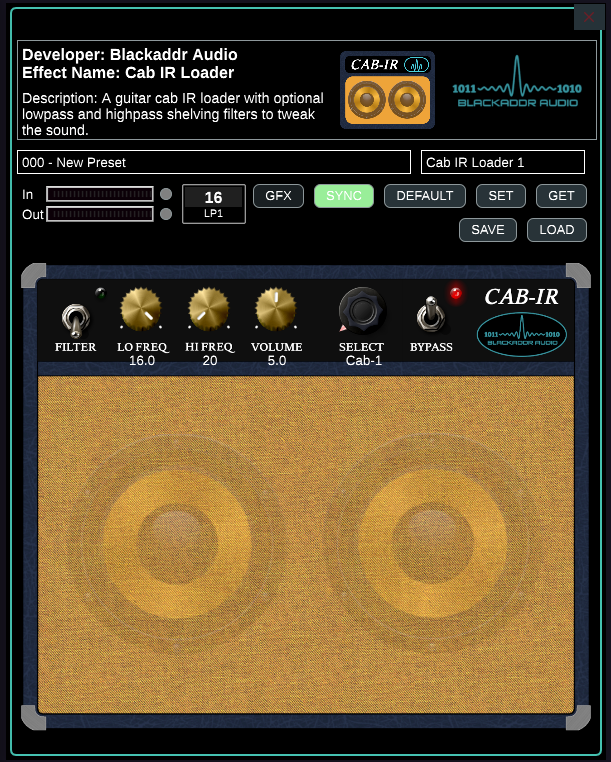
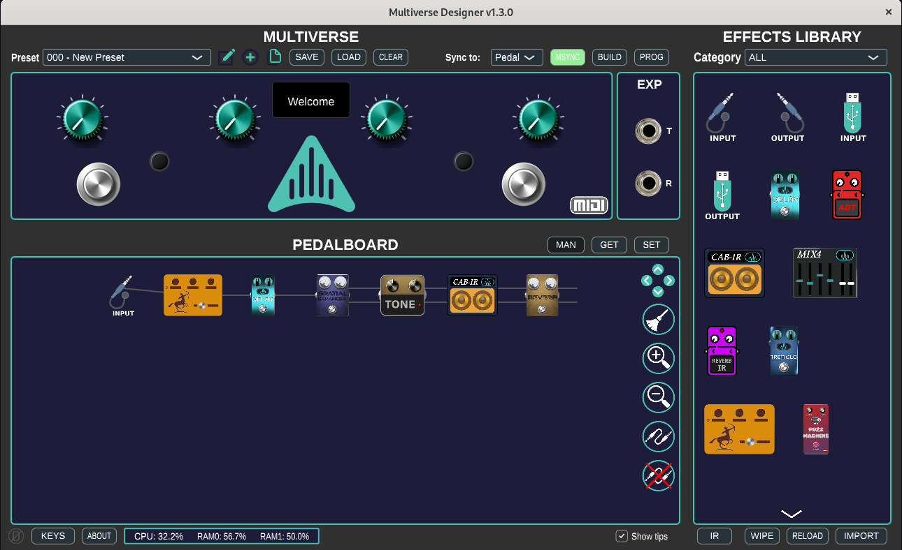

A stereo impulse response loader for the [Aviate Audio Multiverse](https://aviateaudio.com/products/multiverse-pedal). This IR loader uses uniformly partitioned FFT convolution which is adapted from the excellent Teensy implementation by Bill Millier. See his original work [here](https://github.com/bmillier/FFT-Convolution-Filter-Uniformly-partitioned).  
  

